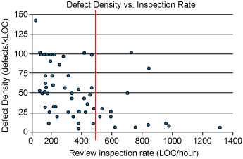

# Best Practices 

 

### Communicate clear goals and expectations of reviewers  
 To ensure that reviews are consistent Reviewers should be given a checklist of what to look for during a review. The checklist should contain the following criteria of what they should be looking for as reviewers :

 #### Design 
* When looking at the design of the code the reviewer should be asking themselves these questions :

 * Does the change belong in the code base or in a library?
 * How well does it integrate with the rest of the system?
 * Do interactions of different pieces of code make sense?
 * Is the code more complex than it need to be?

 #### Functionality 
 * Does the code carry out it's intended function?
 * Is it not only good for the users but also other developers who will have to work with this area of the code base in the future?
 * What are the edge cases?, Think like a user and make sure there are no bugs or concurrency issues.

### Speed of a code review and how long should be spent on a given review
 
 #### 60-90 minutes max per review
 A code reviewer should take the time to carry out a slow and thorough review. However this should take no more than 60-90 minutes according to study's carried out by IBM and others it has been shown that after 60 minutes reviewers tend to get tired and stop finding additional defects/issues with the code.

 

 #### Fast Responses
 Individual responses to code reviews should come as fast as possible but not at the expense of the quality of the review as this could result in the code being below standard. This will eases any frustration that the developer may get from "slow" code reviews.

 ### Handling Developer push back on a review
  A Developer will not always agree with your review when this happens consider the following questions:

   ##### Consider whether they are correct
   * Does their argument for not making your suggested changes make sense?
   * Does it make sense from code health perspective?
   If that is the case let them know you agree and drop your review otherwise continue to advocate your change and ask for further explanation

 ## Quick Links
  * [Home Page](../README.md)
  * [Code Review Home Page](CodeReviews.md)
  * [Bad Practices](CRBP.md)
  
#### References

[11 proven practices for more effective, efficient peer code review, Jason Cohen](https://www.ibm.com/developerworks/rational/library/11-proven-practices-for-peer-review/)

[Google's Engineering Practices documentation](https://google.github.io/eng-practices/review/)

[9 Best Practices for Code Review, Richard Bellairs](https://www.perforce.com/blog/qac/9-best-practices-for-code-review)
