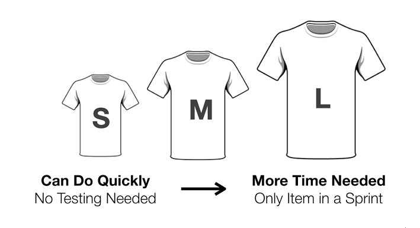

# Estimation Techniques

## [Planning Poker](https://www.mountaingoatsoftware.com/agile/planning-poker)

This is where the team (or anyone in charge with this) will take an item from the backlog and read and discuss it. All team members will then have to mentally estimate the difficulty and write down on a card or piece of paper. When everyone is done, all at once should show their cards. If everyone is in agreement, continue to do the same with the next task. If not, take some time to discuss and repeat the process.

## [T-Shirt Size](https://explainagile.com/blog/t-shirt-size-estimation/)

Rather than using numbers like in planning poker, items can be classified using t-shirt sizes (e.g. XS,S,M,L,XL). In this technique team members would give each item a size and at the end compare all estimates given. If all estimates are the same, that is considered as the ideal size, if not, then discuss among the team to arrive at the same estimate.

## Other techniques

There are also other techniques, like Affinity Estimation or Sorting Method. More info can be found [here](https://medium.com/@warren2lynch/top-7-most-popular-agile-estimation-methods-for-user-stories-69fccf5e418e).

## Quick Links
  * [Home Page](../README.md)
  * [Task Estimation Home Page](TaskEstimation.md)