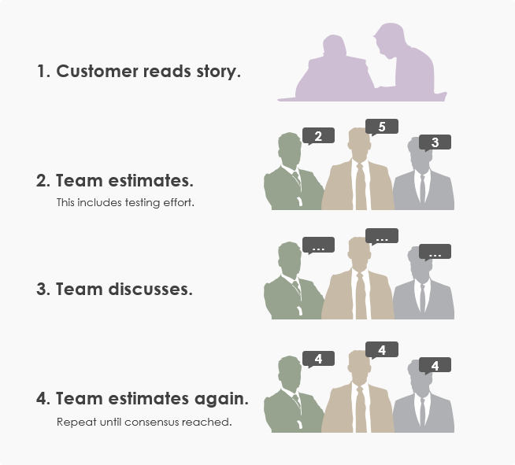
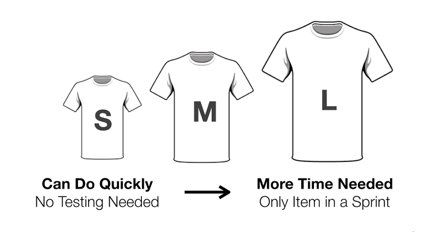

# Task Estimation

#### What is task estimation?

It is the process of measuring the complexity (size) of stories in an Agile project.  
The basic unit of measure is *Story Points* (SP). It is used to measure the size of the story, much the same like a kilogram is used to find out how heavy an object is.

## Estimation Techniques

### <ins>Planning Poker</ins>

This is where the team (or anyone in charge with this) will take an item from the backlog and read and discuss it. All team members will then have to mentally estimate the difficulty and write down on a card or piece of paper. When everyone is done, all at once should show their cards. If everyone is in agreement, continue to do the same with the next task. If not, take some time to discuss and repeat the process.

### [T-Shirt Size](https://explainagile.com/blog/t-shirt-size-estimation/)

Rather than using numbers like in planning poker, items can be classified using t-shirt sizes (e.g. XS,S,M,L,XL). In this technique team members would give each item a size and at the end compare all estimates given. If all estimates are the same, that is considered as the ideal size, if not, then discuss among the team to arrive at the same estimate.

## Best Practices

* **Engage the whole team**  
  By giving everyone a chance to be involved in the estimation process you gain the benefits of having <ins>different insights</ins> and <ins>different perspectives</ins> on estimating a task. Essentially it generates a better consensus and commitment for the estimates being produced.

* **Use multiple techniques**  
  It is important to use multiple techniques or methods for estimating a task (e.g. planning poker, bottom-up, user story points, etc.) and look for similarities between multiple approaches to make sure the estimates are more accurate.

* **Agree on the definition of "Done"**  
  Make sure everyone agrees on a definition of done. It can mean:  
  * Coded and tested
  * Integrated and tested
  * Integrated, tested and closed the JIRA task
  * etc.

* **Know when to stop**  
  Estimating is not an exact science and it can be exhausting estimating an unpredictable task that can change because of evolving requirements. Make sure to get a <ins>broad consensus</ins> between team members. It is better to save time on estimation for potential periodic updates than wasting too much time now.

* **Estimation is a continuous process**  
  The initial estimate is not the final estimate. To avoid high levels of uncertainty, <ins>periodically review</ins> any uncertain estimates based on new information or requirements received.

* **Aim to understand each other**  
  Accept estimate values as long as there is a good rationale agreement. If there is any conflict, it must be handled within the team by understanding the reason for disagreement and adjust estimate values accordingly.

* **Use non-linear scale**  
  It is better to use a non-linear scale such as in the Fibonacci sequence, (e.g. 1,4,9,16). That is because it is quite hard to judge the difference in a linear scale between 3 and 4 compared to judging the difference between  4 and 9. To avoid number bias, clothes sizes can also be used (e.g. S,M,L,XL).
