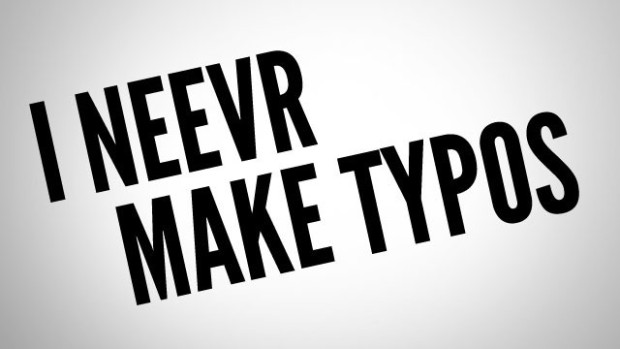

## Bad Practices - Coding Standards

- ### Poor Documentaion
Developers tend to get caught up in the process of coding that they often forget documentation. Often you will forget what exactly all your code does or the approach you took to achieve the solution. Including documentation helps with reusability and maintenance of your code and makes it easy for others to understand.

- ### No Modularisation
Functions/Methods should perform one task and one task only, this helps them to be kept as small as possible improving maintainability. This means that disclosure of needless information is avoided and it emphasises the DRY (Don't Repeat Yourself) belief, eradicating repetitive code.

- ### Code Typos

  The slightest misspelling of a variable or a function can destroy your code and cause multiple run-time errors. They are often not easy to spot. Ensure variable names are easy to spell, as well try to incorporate a good **_IDE (Integrated Development Environment)_** that can fix syntax errors.

- ### Not Following Styling Guides

  Code with consitent style is much easier to read and understand, enabling the reader to understand blocks of code. Your code should be  formatted correctly and indented.

- ### Bad Estimates
  It is important to avoid the temptation to imagine that you'll catch up with your schedule later without adding people to the project. If you fall behind schedule, it's because your time estimates were wrong. That means you need to make a new estimate of the predicted completion time, not blindly stick to an estimate that has already been proven inaccurate.

- ### Testing
  Testing is critical to assessing how well your code works. Software that has not been tested can lead to devastating results upon release. While testing often relies on automated tools and specialized staff, developers should take an active role in the process. They should test each iteration to ensure that it meets the necessary requirements. Many developers believe testing is a waste of time and would lead to unnecessary extensions on to the timeframe given to complete the project, but as they say _"Better safe then sorry"_.

---

#### Quick Links

[Home Page](../README.md)

[Coding Standards Home Page](CodingStandards.md)

---

#### References

[Bad Coding Practices To Avoid.](https://searchsoftwarequality.techtarget.com/answer/What-are-some-bad-coding-practices-to-avoid)

[10 Bad Coding Practices That Wreck Software Development Projects.](https://www.cio.com/article/2448952/10-bad-coding-practices-that-wreck-software-development-projects.html)

[Top 5 Bad Coding Practices.](https://dev.to/blarzhernandez/top-5-bad-coding-practices-avoid-them-to-all-costs-2ab3)
