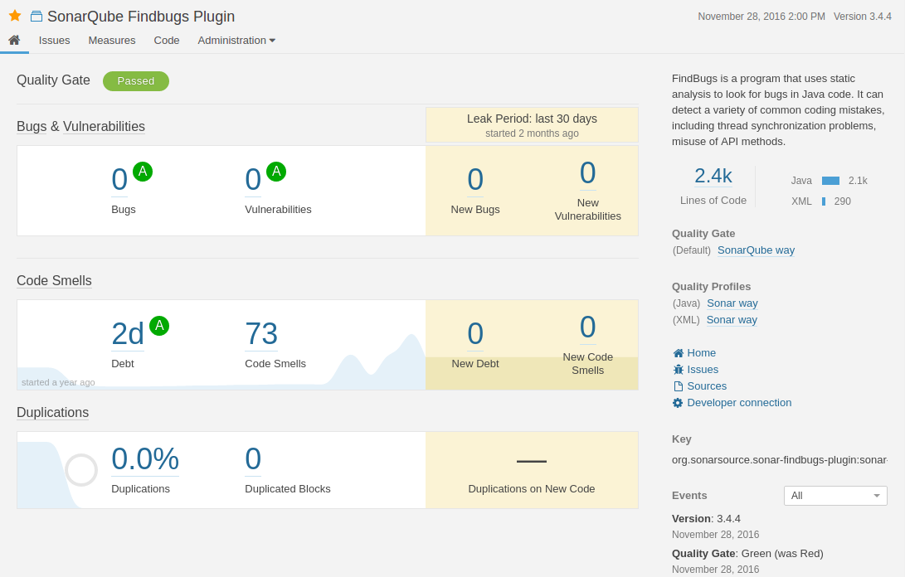

## Categories covered by coding standards

The specific code styling varies from different organizations, programming languages as well as operating systems. The specific styling and rules chosen can be unique to any organization. There are some common areas/topics that coding standards cover.

Common areas covered by coding conventions:

- ### Naming.

  - Consistent naming of variables, functions and classes throughout project.
  - Clear. Most importantly meaningful names. Descriptive.
  - This aspect Must be peer reviewed. Can’t be automated to determine if name of a entity is suitable.

- ### Complexity.

  - Number of conditions.
  - Cyclomatic complexity. Measures possible unique paths. (Quantitative measure).
  - Automatable with SonarQube.

- ### Size

  - The length of classes + methods.
  - Smaller the method, the easier it is to name and understand.
  - The same with classes, classes often become too big where functionality gets added but never taken away leading to bloated classes.
  - Automatable with SonarQube, to enforce classes remain under certain size.

- ### Readability

  - How Easy it is to read, thus comprehend.
  - Includes formatting conventions. Indentations, Line breaks, whitespaces etc.
  - Must be peer reviewed to ensure it’s easily comprehended by human readers.

\
SonarQube is an automatic code review tool that detects bugs, vulnerabilities and other potential issues in source code. It can be used to assist in maintaining coding standards.

---
