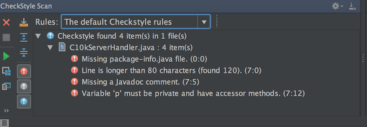

## Coding Standards

Coding standards or coding conventions are a tool used by software developers to enforce consistency among team members within a project. These standards include guidelines, best practices and conventions that programmers should adhere to. Every developer should follow some set of coding standards, whether working on a solo project or in a large team. Coding standards are very beneficial when working on software projects.

---

### Benefits of implementing Coding Standards

- ### Readability.

  - Adherence to coding standards allows one’s code to be better understood.
  - Self-Explanatory code shortens and simplifies the review process.
  - Reduces the need for verbose commenting to describe what each component does.

- ### Less Duplication.

  - Following conventions can reduce inadvertent or deliberate code duplication.
  - With consistent naming conventions and clear logic that will be easily understood, cloned functionality is less likely.
  - This promotes code re-use across the team which speeds up development.

- ### Maintainability.

  - Following standards means that project maintainability in the future is possible
  - Code is predictable.
  - The source code appears as if it was written by one person in one sitting, rather than many bits of mismatched code stuck together.

- ### Identify Problems.

  - Errors/bugs and other potential problems in the code are easier to identify when conventions are obeyed.
  - These bugs stick out within the code so easier to locate.
  - Future proofing due to early problem identification. Solving problems early can help prevents future problems.

- ### Reduced Refactoring needed.

  - Adhering to code rules allows you to have correct code the first time, or at least close to correct.

 

---

### Guidelines

When determining what coding standards, a team should implement, some things should be kept in mind.\
Coding Standards should be very concise and not have personal opinions injected in. The goal of coding standards is to have a set of rules that each developer understands and ideally agrees with the reasoning plus enforcement of that rule. Implementing rules that are too restricting and tough to quantify are characteristics of bad coding standards. Good coding standards are easily understood and quantifiable.

---

#### Quick Links

- [Home Page](../README.md)
- [Categories](CategoriesCodingStandards.md)
- [Bad Practices](BadPracticesCodingStandards.md)

---

#### References

[Effective Coding Standards, Umer Mansoor](https://codeahoy.com/2016/05/22/effective-coding-standards/)

[Importance of Code Quality and Coding Standard in Software Development, Multidots](https://www.multidots.com/importance-of-code-quality-and-coding-standard-in-software-development/)

[Coding conventions (code style), Michael Ernst](https://homes.cs.washington.edu/~mernst/advice/coding-style.html)
